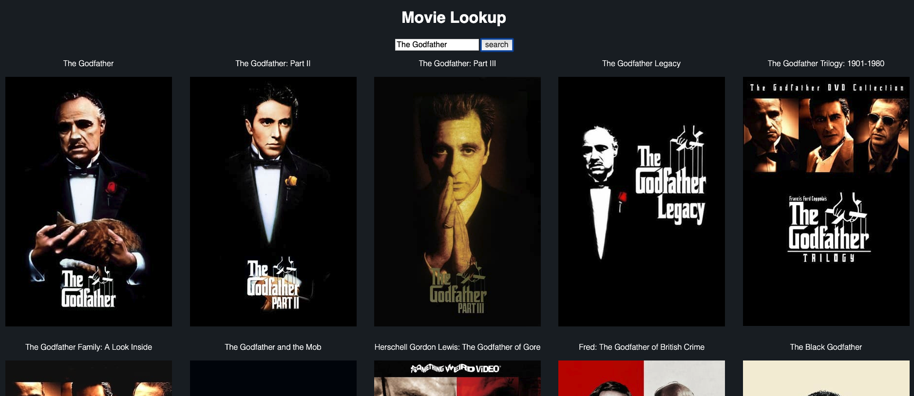
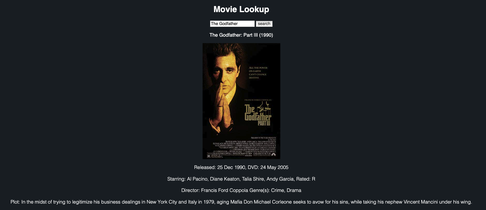
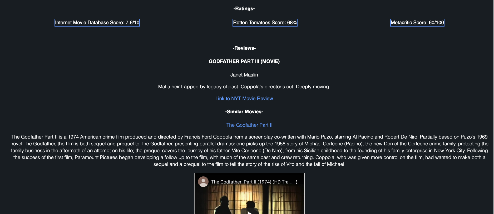

# MovieLookup
Get all the info you'd want about a movie

__See the live site in action [here](https://meta-434.github.io/MovieLookup/)__

## Screenshots
##### _Splash Page_

##### _Search Results_

##### _Selected Movie Info_

##### _Ratings, reviews, suggested movies & trailers_

## Summary
This app is my answer to the lack of an IMDb API. IMDb does however offer their datasets for download, leading to many 
alternatives such as OMDb (Open Movie Database) and TMDb (The Movie Database). Using OMDb and TMDb, I identify movies 
based on a given search parameter. For example, searching Batman is as valid as searching batman, and similarly, 
searching `dark knight` is equally as valid as searching `The Dark Knight`, or just `knight`. Then, the app displays 
matched movies, and waits for the user to select a movie. Once they do, the app loads release date info, starring actors
, a movie poster, genre info, and much more. It displays the ratings the film received from sources like IMDb, 
Metacritic, and Rotten Tomatoes. 

The app searches the New York Times' movie review archive, should it exist, and provides a link to the article, along
with the headline, byline, and author. The NYT API doesn't expose any more information than this as their business model
relies on visitors to their own website, hence the link.

Finally, the app searches for similar movies to the one searched, and looks up a wikipedia entry, the first paragraph of
said Wiki page, and a youtube trailer, should it exist. This portion serves as a "if you liked this movie, check out this"
type of recommendation listing.

##Technology
This app uses HTML5, CSS3, Vanilla JS, and JQuery. 
